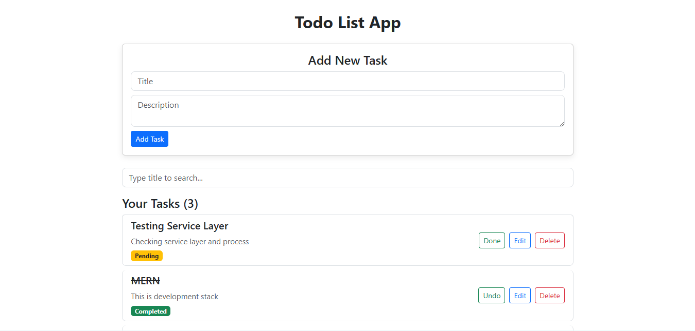

# Todo List Application

## Project Overview

This is a Full Stack Todo List Application developed using the MERN stack technologies. The application allows users to create, update, search, and delete todos. Users can also change the status of a task between Pending and Completed.

This project was developed as a backend and frontend assignment to understand CRUD operations, REST APIs, MongoDB, and React integration.

---

## Features

### Backend

- Create Todo
- Get All Todos
- Get Todo By ID
- Update Todo
- Update Todo Status
- Delete Todo
- Search Todo by Title
- Input Validation
- Error Handling

### Frontend

- Display all todos
- Add new todo
- Edit existing todo
- Delete todo
- Update todo status
- Search todo
- Loading indicator
- Toast notifications

---

## Tech Stack

### Frontend

- React
- Vite
- Axios
- Bootstrap

### Backend

- Node.js
- Express.js

### Database

- MongoDB Atlas
- Mongoose

---

## Project Structure

```
Todo-App
│
├── backend
│   ├── config
│   ├── controllers
│   ├── middlewares
│   ├── models
│   ├── routes
│   ├── services
│   ├── app.js
│   ├── server.js
│   └── package.json
│
├── frontend
│   ├── src
│   │   ├── components
│   │   ├── services
│   │   ├── App.jsx
│   │   └── main.jsx
│   └── package.json
│
└── README.md
```

---

## Installation

### Clone Repository

```bash
git clone https://github.com/AnupamVishwkarma/To-Do-List.git
```

Go to project folder

```bash
cd Todo-App
```

---

## Backend Setup

Go to backend folder

```bash
cd backend
```

Install dependencies

```bash
npm install
```

Create a `.env` file

```
PORT=5000
MONGO_URI=Your_MongoDB_Connection_String
```

Start backend server

```bash
npm run dev
```

Backend runs on

```
http://localhost:5000
```

---

## Frontend Setup

Open another terminal

```bash
cd frontend
```

Install dependencies

```bash
npm install
```

Run frontend

```bash
npm run dev
```

Frontend runs on

```
http://localhost:5173
```

---

## API Endpoints

| Method | Endpoint | Description |
|----------|-----------------------------|------------------------|
| POST | /api/todos | Create Todo |
| GET | /api/todos | Get All Todos |
| GET | /api/todos/:id | Get Todo By ID |
| PUT | /api/todos/:id | Update Todo |
| PATCH | /api/todos/:id/status | Update Todo Status |
| DELETE | /api/todos/:id | Delete Todo |
| GET | /api/todos/search?title=value | Search Todo |

---

## Screenshots

### Home Page



---

## Future Improvements

Some features can be added in future:

- User Authentication
- Due Date
- Categories
- Dark Mode
- Pagination
- Responsive Mobile UI

---

## Author

**Anupam Vishwkarma**

GitHub:
https://github.com/AnupamVishwkarma

LinkedIn:
https://www.linkedin.com/in/anupam-vishwkarma/

---

## Thank You

Thank you for checking this project.